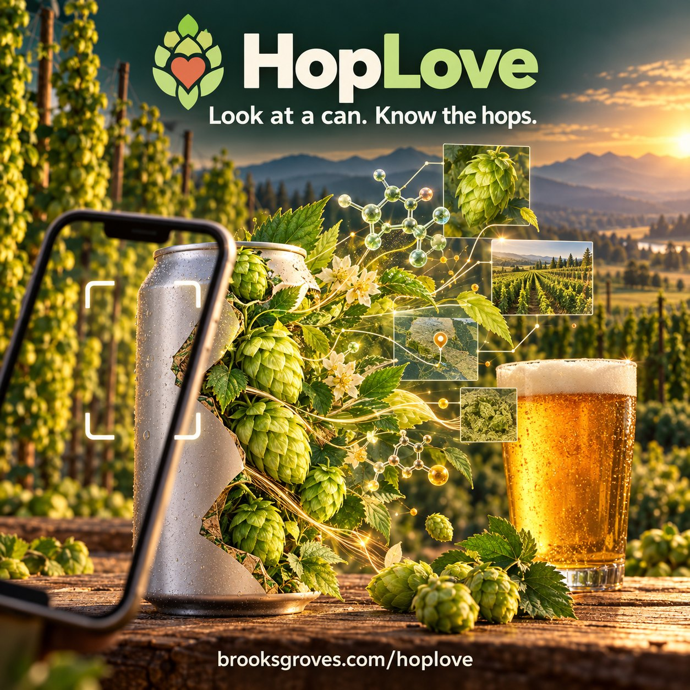

# HopLove 🍺❤️

<p align="center">
  
</p>

**Look at a can. Know the hops.**

### → [brooksgroves.com/hoplove](https://brooksgroves.com/hoplove/)

[What's in the can](https://brooksgroves.com/hoplove/beers/) ·
[Scan a beer](https://brooksgroves.com/hoplove/scan/) ·
[Fresh hop season](https://brooksgroves.com/hoplove/fresh-hop/) ·
[Hop vs hop](https://brooksgroves.com/hoplove/compare/) ·
[Hop science](https://brooksgroves.com/hoplove/science/) ·
[All the hops](https://brooksgroves.com/hoplove/) ·
[How it works](https://brooksgroves.com/hoplove/about/)

You're at the bar. The can says **Citra, Mosaic, Strata**. You nod like you know what that means.

I did that for years — 865 check-ins on Untappd, mostly IPAs. I could tell you which beers I loved. I couldn't tell you *why*, or what Strata actually brings to a beer, or which farm in the Yakima Valley it came off of.

So I built HopLove. **This isn't a brewing tool. It's for the people drinking the beer** — so the next time you're staring at a tap list, you know exactly what you're about to taste.

> **232 hops · 2,036 beers · 32 breweries · 145 fresh hop beers traced to the farm · 22 sources · every number cited**

---

## What you can do with it

🍺 **Find your beer.** Type a beer, a brewery or a hop. Every beer gets a page: each hop in it, what it smells like, how hard it bites, where it was grown — and a plain-English *"what it'll taste like"* that adds the hops up. Plus **beers like this one**, ranked by the closest hop bill, for when you find one you love.

📸 **Snap the can.** Beer not listed? Point your phone at the can, the bottle or the tap list. Claude reads the hops off it and opens every one up.

🌿 **Fresh hop season.** Late August through October, the Pacific Northwest goes a little crazy: hops go from the bine to the kettle the same day, never dried. The [fresh hop guide](https://brooksgroves.com/hoplove/fresh-hop/) lists every fresh hop beer this season and the farm behind each hop — Carpenter Ranches, Sauve & Son, Roy Farms, Coleman, Loza, Van Horn. When a brewery writes *"fresh, wet Roy Farms Strata, with freshly dried Roy Strata"*, HopLove knows which Strata was wet.

⚖️ **Hop vs hop.** Citra or Mosaic? Strata or Nelson? Put any two side by side — what they share, which bites harder, what brewers pair them with, and the beers that use both. Send the link to whoever you're arguing with.

🧪 **The chemistry, for the curious.** What you smell in an IPA is mostly four oils — myrcene, humulene, caryophyllene, farnesene. The bitterness is alpha acids rearranging in the boil. [Hop science](https://brooksgroves.com/hoplove/science/) explains it in bar words, with the actual molecules in 3D you can spin around.

🍻 **Brooks's glass.** My Untappd check-ins sync in every few hours, and my ratings show up on every beer I've had — so you can see what I thought before you order it. (I rate on caps, like Untappd. I'm a 3.75 guy.)

---

## Why you can trust the numbers

Every hop spec on the internet hands you one confident number. `Alpha: 5.5–8.5%`. Says who? The people who bred it? A shop clearing out last year's crop? A website that averaged three other websites?

Nobody says. HopLove does.

Each number is stored **as the source said it, with the source attached** — the breeder, the grower, the merchant. The site rolls them up into a range and draws each source as its own dot on the bar, so when they disagree, you *see* them disagree.

```yaml
# data/hops/styrian-cardinal.yml
alpha_acid:
  unit: percent
  observations:
    - { source: charles-faram, low: 8.0, high: 10.0 }
    - { source: hop-alliance, low: 7.8, high: 7.8 }
```

Charles Faram publishes a range for the variety; Hop Alliance publishes the lot they're selling. Both are true. The page shows both.

The rules are strict, and the build enforces them:

- **No source, no number.** Every figure points at an entry in `data/sources.yml`.
- **Hand-typed numbers must be on the page.** Anything keyed in by hand is checked against a saved copy of the source's page. If the number isn't there, the build stops.
- **Garbage gets excluded out loud.** When a spec sheet prints a total oil of 20 mL/100g (ten times any real hop), that cell is dropped *by name, with the reason*, and the reason prints on every run.
- **A gap beats a guess.** Nine hops still have no numbers, because no source we trust publishes them. Their pages say *awaiting data* instead of making something up.

---

## Where the beers come from

Straight from the breweries' own websites. A crawler reads their beer pages **twice a week** and pulls out the hops each beer names — so new releases just show up.

| Where | Breweries |
|---|---|
| **Seattle** | Cloudburst · Reuben's · Stoup · Georgetown · Fast Fashion · Fair Isle · Ladd & Lass · Elysian · Holy Mountain · Fremont |
| **Portland** | Ex Novo · Breakside · Great Notion · Ecliptic |
| **Hood River** | pFriem · Double Mountain · Kings & Daughters |
| **Bellingham** | Aslan · Chuckanut · Structures · Wander |
| **Yakima** | Bale Breaker · Single Hill |
| **Around Oregon** | Fort George (Astoria) · Block 15 (Corvallis) · Sunriver · Barley Brown's (Baker City) · Pelican (Pacific City) |
| **Around Washington** | 7 Seas (Tacoma) · Triceratops (Tumwater) · Fortside (Vancouver) |
| **And one for old times' sake** | Great Basin (Reno) |

Breweries write hop lists every way imaginable — tidy `Hops:` fields, run-on sentences, all-caps menus, "a galaxy of hops" (lovely, but which ones?). Each one gets its own reader, and the readers know a few things the hard way: *Summer* Pale Ale isn't made with Summer hops, *Crystal malt* isn't Crystal hops, and YCH's *Simcoe Cryo Fresh®* is one fresh hop, not two.

Beers that aren't online come in through the camera. Anything wrong gets fixed with the **Edit this beer** button, and the fix sticks through every future crawl.

---

## How it runs itself

Nobody babysits this. GitHub Actions does the chores:

| When | What |
|---|---|
| Every push | Validate the data, build the site, deploy |
| Mon & Thu | Re-read every brewery, add new beers, redeploy |
| Every 6 hours | Pull Brooks's latest Untappd check-ins |
| On a scan, rating or edit | The site opens a GitHub issue; a workflow turns it into data |
| 1st of the month | Check every hop source for new varieties; open an issue for anything new |

The camera and one-tap saving go through a small Cloudflare Worker that holds the API keys, so nothing secret is ever in the browser. It caps how many photos anyone can read in a day, so a post that takes off can't run up the bill.

---

## The data is free

Static JSON, no key, no sign-up, no rate limit, CORS wide open. **CC BY 4.0** — build whatever you want, just say where it came from.

```
GET https://brooksgroves.com/hoplove/api/v1/beers.json            every brewery, beer and hop bill
GET https://brooksgroves.com/hoplove/api/v1/hops.json             every hop: ranges + every observation
GET https://brooksgroves.com/hoplove/api/v1/hops/citra.json       one hop
GET https://brooksgroves.com/hoplove/api/v1/similar/citra.json    what's closest to Citra, and why
GET https://brooksgroves.com/hoplove/api/v1/acreage.json          USDA acres by variety, state and year
GET https://brooksgroves.com/hoplove/api/v1/sources.json          who said what
GET https://brooksgroves.com/hoplove/api/v1/hops.csv              the lot, for a spreadsheet
```

`v1` won't break. If the shape has to change, it becomes `v2` and `v1` keeps working.

---

## Honest state of the data

| | count | |
|---|---|---|
| Hops | **232** | every one has a page and an API endpoint |
| With real figures | **223** | from breeders, growers and merchants |
| Backed by two or more sources | **103** | where you'll see the dots disagree |
| With a full oil breakdown | **135** | the rest are waiting on a source that publishes myrcene |
| With aroma descriptors | **161** | |
| Still leaning on a placeholder somewhere | **13** | flagged in red on the page until a real source replaces it |
| No numbers yet | **9** | Ibuki, Teamaker, Ultra, Newport and friends. No trusted source covers them. |

---

## Under the hood

```
data/hops/*.yml          one file per hop — the actual product
data/sources.yml         the source registry. no entry, no number
data/beers/*.yml         hop lists read from breweries' own sites (generated)
data/beers/scanned/      beers added from the camera
data/beers/overrides.yml hand fixes from "Edit this beer"
data/untappd/            Brooks's check-ins and Untappd beer history
data/ratings.yml         ratings set on HopLove
data/acreage/            USDA National Hop Report, 2015–2025 (generated)
schema/                  JSON Schema — the contract
scripts/validate.js      the bouncer
scripts/lib/rollup.js    observations → published ranges. all the arithmetic lives here
scripts/build.js         data in, API + website out
site/                    templates, styles, the scan page, the science page
tools/ingest/            the readers: hop sources, breweries, Untappd, USDA
tools/worker/            the Cloudflare Worker (camera proxy, limits, one-tap saves)
```

The website is rendered *from* the API data, so the two can't drift apart.

**Hop sources:** Hopsteiner, BarthHaas, Yakima Chief Ranches and the Hop Breeding Company each have their own scraper; one-page spec sheets from Indie Hops, Crosby, Charles Faram, Hop Alliance, Yakima Valley Hops, John I. Haas, Yakima Quality Hops, CLS Farms and NZ Hops are read from saved copies; acreage comes from the USDA. Scrapers write observations and nothing else — they never average or merge. The maths happens at build time, in public, the same way for every hop.

### Run it yourself

```bash
git clone https://github.com/bdgroves/hoplove.git
cd hoplove
pixi install

pixi run validate    # yells at you about the data
pixi run build       # writes dist/
pixi run serve       # http://localhost:4173
pixi run check       # exactly what CI runs
```

(No pixi? `npm install && npm run build` works too.)

---

## What's next

- [ ] **More breweries.** Anyone in the Northwest whose website names their hops is fair game. Icicle in Leavenworth is next — their site just needs a real browser to read.
- [ ] **"Most used in"** on every hop page — Strata shows up mostly in hazies, that kind of thing — counted from the beers.
- [ ] **A fresh hop 2026 recap** once harvest is done: the most-used fresh hops, the busiest farms, and the best of what I drank.
- [ ] **The hops you love.** Once enough of my ratings are in, a page that works out which hops show up in the beers I rate highest. Then maybe one for you.
- [ ] **The last nine hops,** whenever a trusted source publishes their numbers.

---

## Say hi

Something wrong with a beer? Hit **✉️ Email Brooks** on its page, or [open an issue](../../issues/new). A brewery that wants its beers on here: put your hop list on your website, in plain words, one page per beer — HopLove will find it. Or just [email me](mailto:contact@brooksgroves.com?subject=HopLove).

If HopLove ever saves you from a bad six-pack, [buy me a beer](https://ko-fi.com/brooksgroves). 🍺

The story of why this exists: [What's in the Can? Building HopLove](https://brooksgroves.com/blog/hoplove-post.html).

---

## The fine print

Code is **MIT**. Data is **CC BY 4.0**. Not affiliated with any brewery, hop breeder, farm, merchant or Untappd. Variety names are the marks of their owners and are used to name the plants, which is what names are for. See [NOTICE.md](NOTICE.md).

---

Built in the Pacific Northwest, a couple hours from the Yakima Valley, where about three-quarters of America's hops come off the bine every fall. Around here hops aren't an ingredient — they're a harvest you can smell on the wind in September.

Cheers. Go drink something hoppy. 🍻
